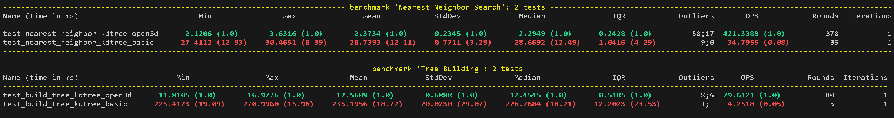

# kdtree plauground
kdtreeを色々試したい。
1. kdtree_basic: numpyのみで自前実装。アルゴリズムの理解と速度計測のベースライン
2. kdtree_open3d: open3dに実装されているKDTreeを使った実装。別のライブラリで良い感じに実装されているものと速度比較したいモチベ。

# 速度比較結果
以下のコマンドで速度比較ができる。
```
make test-benchmark
```

## 速度の計測対象
pytest-benchmarksを使って計測

1. KDTreeの近傍点探索速度
    - 木の生成は含まない
    - KDTreeに格納されたデータ（3次元5万点）に対して、クエリ（1点）を200種類探索させた速度の計測
    - 1クエリづつfor文で回しているので、1点の探索を200回するときの速度になっているはず
2. KDTreeの生成速度
    - ３次元5万点のデータに対してKDTreeを構築する速度

自分の環境（CPU: i7-13700K, GPU: RTX4080, RAM: 32GB(DDR5-4800), OS: WSL2 Ubuntu22.04）での結果

